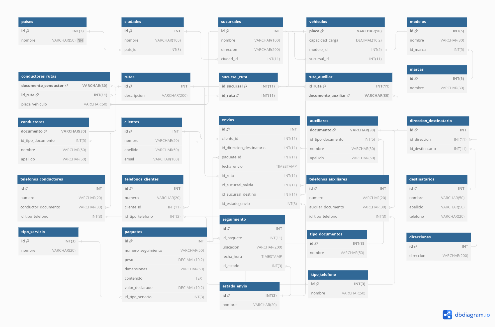

# Base de datos sobre gestión de envíos

> [!NOTE]
>
> Como una firma de consultoría que se especializa en el desarrollo de bases de datos, ha obtenido
> una licitación para el desarrollo de un modelo de datos y un sistema de gestión de distribución de
> paquetes para un proveedor de logística cuya operación es a nivel nacional e internacional con
> sucursales y operaciones similares a las de Amazon. Ofrece servicios de distribución de paquetes
> a nivel nacional e internacional con sucursales en diferentes ciudades y países. El sistema se
> ocupará de la gestión de paquetes, el seguimiento de envíos, la información de los clientes, el
> control de sucursales, vehículos, chóferes y asistentes de distribución, así como.


## Diagrama de la base de datos:



## Solución de casos de uso:

> [!IMPORTANT]
>
> Los siguientes casos de uso están conectados, por ende para que funcionen deben realizarse en order


- ### Caso de uso 1: Registrar un nuevo país

  ```sql
  INSERT INTO paises(nombre)
  VALUES ('Nepal');
  ```

- ### Caso de uso 2: Registrar una nueva ciudad

  ```sql
  INSERT INTO ciudades(nombre, pais_id)
  VALUES ('Katmandu', 16);
  ```

- ### Caso de uso 3: Registrar una nueva sucursal

  ```sql
  INSERT INTO sucursales(nombre, direccion, ciudad_id)
  VALUES ('Sucursal central de Katmandu', '132 Main Av', 17);
  ```

- ### Caso de uso 4: Registrar un nuevo cliente

  ```sql
  INSERT INTO clientes (nombre, apellido, email) 
  VALUES ('Pablo', 'Hernandez', 'pablo.hernandez@example.com');
  ```

- ### Caso de uso 5: Registrar un nuevo teléfono para un cliente

  ```sql
  INSERT INTO telefonos_clientes (numero, cliente_id, id_tipo_telefono) 
  VALUES ('312-5184702', 11, 1);
  ```

- ### Caso de uso 6: Registrar un nuevo paquete

  ```sql
  INSERT INTO paquetes (numero_seguimiento, peso, dimensiones, contenido, valor_declarado, id_tipo_servicio) 
  VALUES ('PKG1323233', 3.25, '20x30x10 cm', 'Cds de dudosa procedencia', 50.00, 1);
  ```

- ### Caso de uso 7: Registrar un nuevo envió

  ```sql
  INSERT INTO envios (cliente_id, id_direccion_destinatario, paquete_id, fecha_envio, id_ruta, id_sucursal_salida, id_sucursal_destino, id_estado_envio) 
  VALUES (11, 7, 11, '2024-02-20 09:00:00', 5, 1, 2, 1);
  ```

- ### Caso de uso 8: Registrar un nuevo vehiculo

  ```sql
  INSERT INTO vehiculos (placa, capacidad_carga, modelo_id, sucursal_id) 
  VALUES ('QUD80B', 5000.00, 1, 1);
  ```

- ### Caso de uso 9: Registrar un nuevo conductor

  ```sql
  INSERT INTO conductores (documento, id_tipo_documento, nombre, apellido) 
  VALUES ('6323228', 1, 'Carlos', 'Mendez');
  ```

- ### Caso de uso 10: Registrar un nuevo numero para un conductor

  ```sql
  INSERT INTO telefonos_conductores (numero, conductor_documento, id_tipo_telefono) 
  VALUES ('313-3232233', '6323228', 1);
  ```

- ### Caso de Uso 11: Asignar un Conductor a una Ruta y un Vehículo

  ```sql
  INSERT INTO conductores_rutas (documento_conductor, id_ruta, placa_vehiculo) 
  VALUES ('6323228', 6, 'QUD80B');
  ```

- ### Caso de Uso 12: Registrar un nuevo auxiliar

  ```sql
  INSERT INTO auxiliares (documento, id_tipo_documento, nombre, apellido) 
  VALUES ('110234222', 1, 'Ronal', 'García');
  ```

- ### Caso de Uso 13: Asignar un auxiliar a una ruta

  ```sql
  INSERT INTO ruta_auxiliar (id_ruta, documento_auxiliar) 
  VALUES (6, '110234222');
  ```

- ### Caso de Uso 14: Registrar un Evento de Seguimiento para un Paquete

  ```sql
  INSERT INTO seguimiento (id_paquete, ubicacion, fecha_hora, id_estado) 
  VALUES (11, 'Nueva York', '2024-02-10 20:00:00', 2);
  ```

- ### Caso de Uso 15: Generar un Reporte de Envíos por Cliente

  ```sql
  SELECT c.nombre AS nombre_cliente, e.id AS id_envio
  FROM envios AS e
  JOIN clientes AS c ON c.id = e.cliente_id
  WHERE c.id = 11;
  ```

- ### Caso de Uso 16: Actualizar el estado de un paquete 

  > [!NOTE]
  >
  > En el ddl se creo un trigger con el objetivo de que lo que se modifique sea el seguimiento añadiendo una row a la tabla, y el estado de el paquete se modifique en envió según este.

  

  ```sql
  INSERT INTO seguimiento (id_paquete, ubicacion, fecha_hora, id_estado) 
  VALUES (11, 'Los angeles', '2024-03-10 12:00:00', 3);
  ```

- ### Caso de Uso 17: Rastrear la ubicación actual de un paquete

  ```sql
  SELECT p.contenido AS contenido, s.ubicacion AS ubicacion, s.fecha_hora AS fecha
  FROM seguimiento AS s
  JOIN (
      SELECT id_paquete, MAX(fecha_hora) AS max_fecha_hora
      FROM seguimiento
      GROUP BY id_paquete
  ) AS max_fecha ON s.id_paquete = max_fecha.id_paquete AND s.fecha_hora = max_fecha.max_fecha_hora
  JOIN paquetes AS p ON p.id = max_fecha.id_paquete
  WHERE p.numero_seguimiento = 'PKG1323233'; 
  ```

## Casos multitabla

- ### Caso de Uso 1: Obtener Información Completa de Envíos

  ```sql
  SELECT CONCAT(c.nombre, ' ', c.apellido) AS cliente,
      p.contenido AS contenido_paquete,
      r.descripcion AS ruta,
      CONCAT(co.nombre, ' ', co.apellido) AS conductor,
      ss.nombre AS sucursal_salida,
      sd.nombre AS sucursal_destino
  FROM envios AS e
  JOIN clientes AS c ON c.id = e.cliente_id
  JOIN paquetes AS p ON p.id = e.paquete_id
  JOIN rutas AS r ON r.id = e.id_ruta
  JOIN conductores_rutas AS coru ON r.id = coru.id_ruta
  JOIN conductores AS co ON co.documento = coru.documento_conductor
  JOIN sucursales AS ss ON ss.id = e.id_sucursal_salida 
  JOIN sucursales AS sd ON sd.id = e.id_sucursal_destino
  ORDER BY e.id;
  ```

- ### Caso de Uso 2: Obtener Historial de Envíos de un Cliente

  ```sql
  SELECT CONCAT(c.nombre, ' ', c.apellido) AS cliente,
      p.contenido AS contenido_paquete,
      r.descripcion AS ruta,
      CONCAT(co.nombre, ' ', co.apellido) AS conductor,
      ss.nombre AS sucursal_salida,
      sd.nombre AS sucursal_destino
  FROM envios AS e
  JOIN clientes AS c ON c.id = e.cliente_id
  JOIN paquetes AS p ON p.id = e.paquete_id
  JOIN rutas AS r ON r.id = e.id_ruta
  JOIN conductores_rutas AS coru ON r.id = coru.id_ruta
  JOIN conductores AS co ON co.documento = coru.documento_conductor
  JOIN sucursales AS ss ON ss.id = e.id_sucursal_salida 
  JOIN sucursales AS sd ON sd.id = e.id_sucursal_destino
  WHERE c.id = 4;
  ```
  
- ### Caso de Uso 3: Listar Conductores y sus Rutas Asignadas

  ```sql
  SELECT CONCAT(c.nombre, ' ', c.apellido) AS conductor,
  	r.descripcion AS ruta,
  	CONCAT(v.placa, '', m.nombre) AS vehiculo,
  	s.nombre AS sucursal,
  	s.direccion AS direccion_sucursal
  FROM conductores_rutas AS cr
  JOIN conductores AS c ON c.documento = cr.documento_conductor
  JOIN rutas AS r ON r.id = cr.id_ruta
  JOIN vehiculos AS v ON v.placa = cr.placa_vehiculo
  JOIN modelos AS m ON m.id = v.modelo_id
  JOIN sucursales AS s ON s.id = cr.id_sucursal;
  ```


- ### Caso de Uso 4: Obtener Detalles de Rutas y Auxiliares Asignados

  ```sql
  SELECT r.descripcion AS ruta,
  	CONCAT(a.nombre, '', a.apellido) AS auxiliar,
  	a.documento AS documento,
  	ta.numero AS numero_telefono,
  	tt.nombre AS tipo_telefono
  FROM ruta_auxiliar AS ra
  JOIN rutas AS r ON r.id = ra.id_ruta
  JOIN auxiliares AS a ON a.documento = ra.documento_auxiliar
  JOIN telefonos_auxiliares AS ta ON a.documento = ta.auxiliar_documento
  JOIN tipo_telefono AS tt ON tt.id = ta.id_tipo_telefono
  ORDER BY r.id;
  ```


- ### Caso de Uso 5: Generar Reporte de Paquetes por Sucursal y Estado

  > [!NOTE]
  >
  > La interpretación fue la siguiente, se toma la sucursal y es estado envió y se listan los paquetes que cumplan con los requisitos

  

  ```sql
  SELECT p.contenido AS paquete,
      s.nombre AS sucursal,
      s.direccion AS direccion_sucursal,
      ee.nombre AS estado_envio
  FROM paquetes AS p
  JOIN envios AS e ON p.id = e.paquete_id
  JOIN sucursales AS s ON s.id = e.id_sucursal_salida
  JOIN estado_envio AS ee ON ee.id = e.id_estado_envio
  WHERE s.id = 10 AND e.id_estado_envio = 2;
  ```

- ### Caso de Uso 6: Obtener Información Completa de un Paquete y su Historial de Seguimiento

  ```sql
  SELECT p.id AS id,
  	p.numero_seguimiento AS numero_de_seguimiento,
  	p.peso AS peso_paquete,
  	p.dimensiones AS dimensiones,
  	p.contenido AS contenido,
  	p.valor_declarado AS valor_paquete,
  	ts.nombre AS servicion,
  	s.ubicacion AS historial_ubicacion,
  	s.fecha_hora AS historial_fecha,
  	ee.nombre AS historia_estado
  FROM paquetes AS p
  JOIN seguimiento AS s ON p.id = s.id_paquete
  JOIN tipo_servicio AS ts ON ts.id = p.id_tipo_servicio
  JOIN estado_envio AS ee ON ee.id = s.id_estado
  WHERE p.id = 10
  ORDER BY s.fecha_hora DESC;
  ```

## Casos de uso BETWEEN, IN, NOT IN

- ### Caso de uso 1: obtener paquetes enviados dentro de un rango de fechas

  ```sql
  SELECT p.id AS id,
  	p.numero_seguimiento AS numero_de_seguimiento,
  	p.peso AS peso_paquete,
  	p.dimensiones AS dimensiones,
  	p.contenido AS contenido,
  	p.valor_declarado AS valor_paquete,
  	e.fecha_envio AS fecha_de_envio
  FROM paquetes AS p
  JOIN envios AS e ON p.id = e.paquete_id
  WHERE e.fecha_envio BETWEEN '2024-06-20 09:00:00' AND '2024-06-25 09:00:00'
  ORDER BY e.fecha_envio DESC;
  ```

- ### Caso de Uso 2: Obtener Paquetes con Ciertos Estados

  ```sql
  SELECT p.id AS id,
  	p.numero_seguimiento AS numero_de_seguimiento,
  	p.peso AS peso_paquete,
  	p.dimensiones AS dimensiones,
  	p.contenido AS contenido,
  	p.valor_declarado AS valor_paquete,
  	ee.nombre AS estado
  FROM paquetes AS p
  JOIN envios AS e ON p.id = e.paquete_id
  JOIN estado_envio AS ee ON ee.id = e.id_estado_envio
  WHERE e.id_estado_envio IN (2, 3);
  ```

- ### Caso de Uso 3: Obtener Paquetes Excluyendo Ciertos Estados

  ```sql
  SELECT p.id AS id,
  	p.numero_seguimiento AS numero_de_seguimiento,
  	p.peso AS peso_paquete,
  	p.dimensiones AS dimensiones,
  	p.contenido AS contenido,
  	p.valor_declarado AS valor_paquete,
  	ee.nombre AS estado
  FROM paquetes AS p
  JOIN envios AS e ON p.id = e.paquete_id
  JOIN estado_envio AS ee ON ee.id = e.id_estado_envio
  WHERE e.id_estado_envio NOT IN (2, 3);
  ```

- ### Caso de Uso 4: Obtener Clientes con Envíos Realizados Dentro de un Rango de Fechas

  ```sql
  SELECT CONCAT(c.nombre, ' ', c.apellido) AS cliente,
  	c.email AS email,
  	e.fecha_envio AS fecha_de_envio
  FROM clientes AS c
  JOIN envios AS e ON c.id = e.cliente_id
  WHERE e.fecha_envio BETWEEN '2024-06-20 09:00:00' AND '2024-06-25 09:00:00'
  ORDER BY e.fecha_envio DESC;
  ```

- ### Caso de Uso 5: Obtener Conductores Disponibles que No Están Asignados a Ciertas Rutas

  ```sql
  SELECT CONCAT(c.nombre, ' ', c.apellido) AS conductor,
  	tc.numero AS telefono,
  	r.descripcion AS ruta
  FROM conductores AS c
  JOIN conductores_rutas AS cr ON c.documento = cr.documento_conductor
  JOIN telefonos_conductores AS tc ON c.documento = conductor_documento
  JOIN rutas AS r ON r.id = cr.id_ruta
  WHERE r.id NOT IN (1, 3, 5,7);
  ```

- ### Caso de Uso 6: Obtener Información de Paquetes con Valor Declarado Dentro de un Rango Específico

  ```sql
  SELECT p.id AS id,
  	p.numero_seguimiento AS numero_de_seguimiento,
  	p.peso AS peso_paquete,
  	p.dimensiones AS dimensiones,
  	p.contenido AS contenido,
  	p.valor_declarado AS valor_paquete,
  	ee.nombre AS estado
  FROM paquetes AS p
  JOIN envios AS e ON p.id = e.paquete_id
  JOIN estado_envio AS ee ON ee.id = e.id_estado_envio
  WHERE p.valor_declarado BETWEEN 50 AND 100
  ORDER BY p.valor_declarado DESC;
  ```

- ### Caso de Uso 7: Obtener Auxiliares Asignados a Rutas Específicas

  ```sql
  SELECT a.documento AS id_auxiliar,
      CONCAT (a.nombre, ' ', a.apellido) AS auxiliar,
      r.descripcion AS ruta,
      r.id AS id_ruta
  FROM auxiliares AS a
  JOIN ruta_auxiliar AS ra ON a.documento = ra.documento_auxiliar
  JOIN rutas AS r ON r.id = ra.id_ruta
  WHERE r.id IN (1,2,3,4)
  ORDER BY r.id;
  ```

- ### Caso de Uso 8: Obtener Envíos a Destinos Excluyendo Ciertas Ciudades

  ```sql
  SELECT CONCAT(c.nombre, ' ', c.apellido) AS cliente,
      p.contenido AS contenido_paquete,
      ss.nombre AS sucursal_salida,
      sd.nombre AS sucursal_destino,
      ci.nombre AS ciudad_sucursal,
      ci.id AS id_ciudad
  FROM envios AS e
  JOIN clientes AS c ON c.id = e.cliente_id
  JOIN paquetes AS p ON p.id = e.paquete_id
  JOIN sucursales AS ss ON ss.id = e.id_sucursal_salida 
  JOIN sucursales AS sd ON sd.id = e.id_sucursal_destino
  JOIN ciudades AS ci ON ci.id = sd.ciudad_id
  WHERE ci.id NOT IN (2, 3, 6, 8, 11, 15)
  ORDER BY ci.id;
  ```

- ### Caso de Uso 9: Obtener Seguimientos de Paquetes en un Rango de Fechas

  ```sql
  SELECT p.id AS id,
  	p.numero_seguimiento AS numero_de_seguimiento,
  	p.peso AS peso_paquete,
  	p.dimensiones AS dimensiones,
  	p.contenido AS contenido,
  	p.valor_declarado AS valor_paquete,
  	ee.nombre AS estado_paquete,
  	s.ubicacion AS ubicacion_paquete,
  	s.fecha_hora AS fecha_seguimiento
  FROM paquetes AS p
  JOIN seguimiento AS s ON p.id = s.id_paquete 
  JOIN envios AS e ON p.id = e.paquete_id
  JOIN estado_envio AS ee ON ee.id = e.id_estado_envio
  WHERE s.fecha_hora BETWEEN '2024-06-20 09:00:00' AND '2024-06-25 09:00:00'
  ORDER BY s.fecha_hora DESC;
  ```

- ### Caso de Uso 10: Obtener Clientes que Tienen Ciertos Tipos de Paquetes

  ```sql
  SELECT CONCAT(c.nombre, ' ', c.apellido) AS cliente,
  c.email,
  p.contenido AS contenido_paquete,
  ts.nombre AS tipo_servicio
  FROM clientes AS c
  JOIN envios AS e on c.id = e.cliente_id
  JOIN paquetes AS p ON p.id = e.paquete_id
  JOIN tipo_servicio AS ts ON ts.id = p.id_tipo_servicio
  WHERE p.id_tipo_servicio IN (1, 2);
  ```

